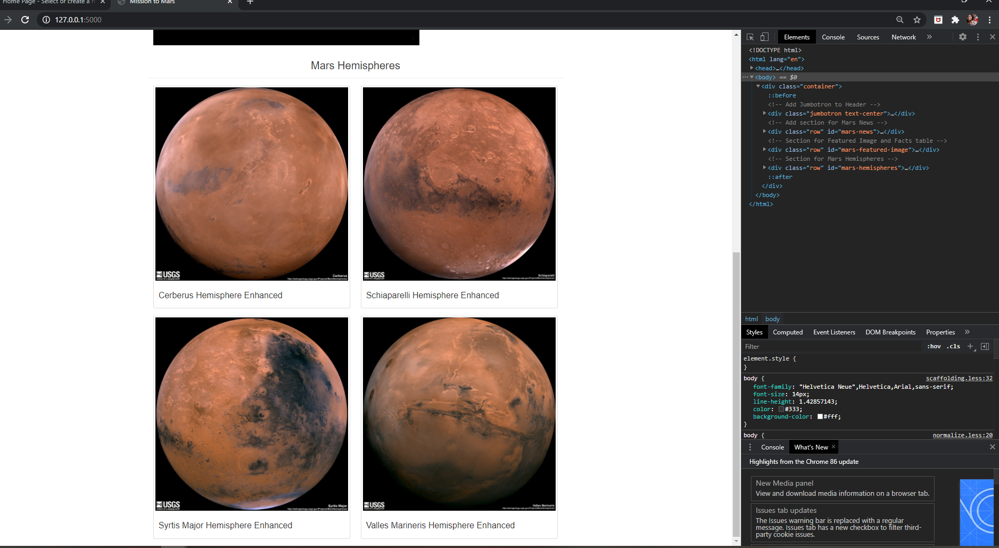
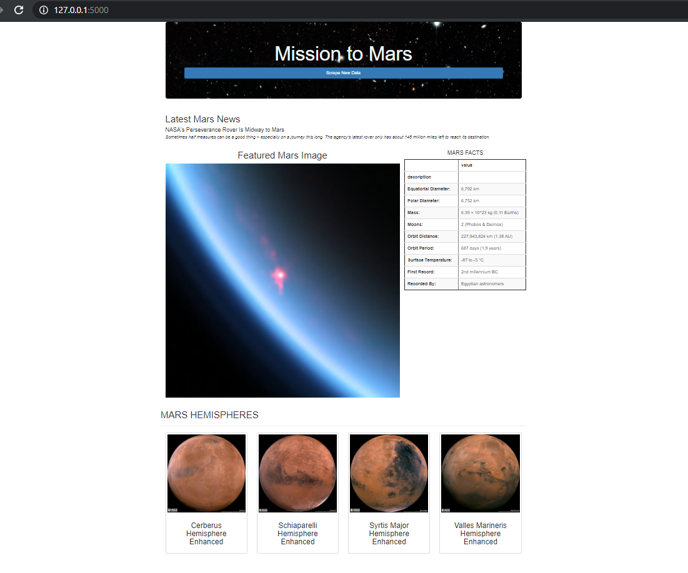

# Mission_to_Mars

This application that scrapes the web for the latest news, facts and Mars's hemispheres information and full size pictures that show intesting information in one HTML page. All this is done in a sequence using various python tools, HTML and CSS

## Purpose 
- To showcase my interest with the red planet Mars. 
- Information on various facts and the latest news.
- To have this update all in one click of a button.

## Resources
- jupyter notebook v6.1.1
- VS code v1.50.1
- python 3.8.5
- CSS 
- HTML

## Summary 
- Web scraping carried out on various sites
    1. NASA Mars News - collecting news briefs, titles
    [link](https://mars.nasa.gov/news/)

    2. JPL Space Images - Collecting the featured images
    [link](https://www.jpl.nasa.gov/spaceimages/?search=&category=Mars)

    3. Space facts - Mars fact page, and converted the webpage info into a table using pandas, eg. diameter, mass etc.
    [link](http://space-facts.com/mars/)

    4. Mars weather - Collecting information and data on the weather on Mars.
    [link](https://mars.nasa.gov/insight/weather/)

    5. Hemispheres of Mars - both thumbnail images, full resolution and the hemisphere names are recorded. 
    [link](https://astrogeology.usgs.gov/search/results?q=hemisphere+enhanced&k1=target&v1=Mars)

## Result
 

#### Toggle Screen for mobile platforms. 

#### Webpage Bootstrap Customization

